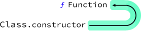
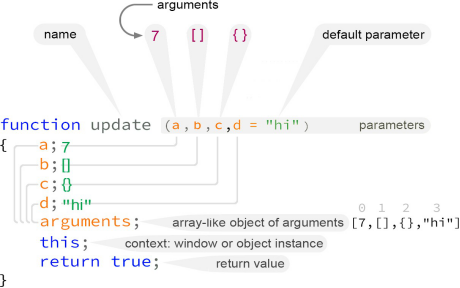

# 第一章 格式介绍

本书的结构考虑了连续性：它应该以连续的顺序从头到尾阅读。 但是，它也可以用作桌面参考，以便在需要时查找孤立的示例。

**《JavaScript语法》**不是完整的JavaScript参考或手册。 但是，这可能是一件好事。 主题被简化为现代JavaScript环境中的重要内容。

亦即： imports, classes, constructors, 函数式编程背后的关键原则，包括**ES5 - ES10**中许多功能都包含在本书中。

“ES”规范之间的区别变得不那么重要了。所有这些都是JavaScript。但只是为了给读者一点看法......

有时你会看到像这样的标签。

这仅仅意味着这个特性作为Ecmascript的ES10规范的一部分添加到了javascript中。

## 1.1 创意沟通

有些JavaScript很容易，有些很难。并非所有内容都可以仅通过源代码来解释。有些事情是基于无形的想法或原则。

在本教程中，您将看到许多有创造性的沟通手段，旨在使学习过程更轻松，也许会更有趣。

这其中的一个例子是颜色编码图解。

### 1.1.1 理论

并非所有主题都需要广泛的理论。另一方面，有些事情没有它是没有意义的。为了充分理解一个特定的概念，在绝对必要的情况下，还将包括其他讨论。

### 1.1.2 应用实例

在理论讨论的基础上，通过一个实例，我们可以看到具体的实现过程。通常用源代码列表来解释。

### 1.1.3 源代码

将提供源代码清单，以巩固前文的基本原则。
```
// 从Bird类实例化sparrow实例
let sparrow = new Bird("sparrow", "gray");
sparrow.fly();
sparrow.wlak();
sparrow.lay_egg();
sparrow.talk(); // Error, 只有Parrot能talk
```

这是一个从Bird类实例化sparrow对象并使用它的一些方法的一个例子。

### 1.1.4 颜色编码图解

在创建描述JavaScript背后的基本思想的图解方面投入了大量精力。它们是为了交流价值而设计的，在那些难以掌握的抽象概念需要用肉眼解释的地方，希望它们能够加速学习过程。 本书中有两种类型的图解：**抽象概念**和**源代码关闭**。

**抽象概念**

有时候没有图解就无法解释一个抽象概念或其结构。在这种情况下，会显示一个图解。

图 1.1：类的构造函数是Function类的对象函数。

这是另外一个可视化剖析JavaScript函数的图解：

图1.2： JavaScript函数剖析。

**源代码关闭**

大多数源代码都伴随着源代码列表。

但是当我们需要关闭一个特定的重要主题，将会显示一个略大的包含源代码和其他颜色编码突出显示的图解。例如，这是一个在事件回调函数的上下文中使用匿名函数的探索：

图1.3：异步函数用为setTimeout事件回调。

在此例中源代码忽略了行号因为它并不重要。

**内容**

我们不会花太多的书本空间和时间在无数的函数列表或每个对象上的可用方法上。这种类型的信息可以很容易地从Mozilla的MDN网络文档、W3Schools和StackOverflow在线查询和实践。

本书的大部分内容都是为现代JavaScript开发量身定做的，它倾向于>=ECMAScript6规范、函数编程：使用高阶数组函数、箭头函数以及理解执行上下文。

### 1.1.5 行为准则

偶尔出现的该做和不该做的部分将提供富有洞察力的提示。