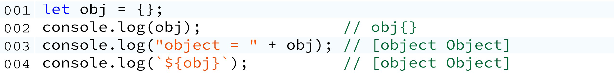

# 第二章 Chrome控制台

## 2.0.1 Console.log之外

许多程序员可能只知道Chrome浏览器的console.log，然而控制台API包含了一些其它有实际用途的方法，特别是在需要需要计时的场景下。

**copy(obj) 函数**

将现有对象的JSON表示形式复制到复制缓冲区：

现在JSON对象在复制粘贴缓冲区中，您可以将它粘贴到任何文本编辑器中。

在本例中，x是一个简单的自创建对象。但是想象一下这样一种情况：从数据库API返回一个更复杂的对象。

**注意：** 只返回JSON，这意味着方法不会到达复制缓冲区。（JSON字符串格式不支持方法，只支持属性。）

## 2.0.2 console.dir

如果要查看对象所有的属性和方法，可以使用console.dir方法直接打印到控制台：

神奇的是，你甚至可以打印输出DOM元素：

## 2.0.3 console.error

console.error的好处在于它还提供了堆栈跟踪：

## 2.0.4 console.time()和console.timeEnd()

您可以跟踪函数调用之间的时间量。这在优化代码时很有用：

控制台输出：

## 2.0.5 console.clear

**打印对象**
JavaScript中所有的对象都有.toString()方法。向console.log（value）提供对象时，它可以将其作为对象或字符串打印。

