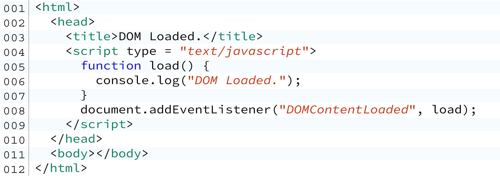
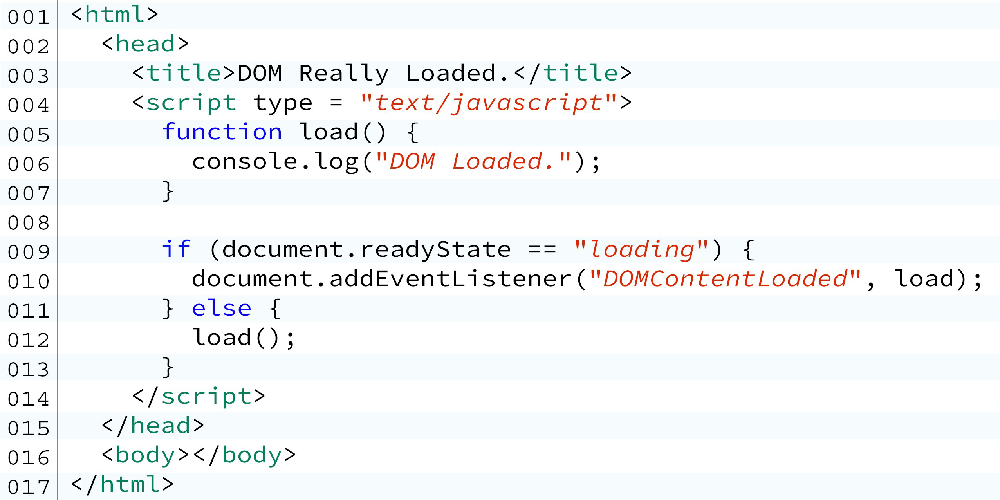
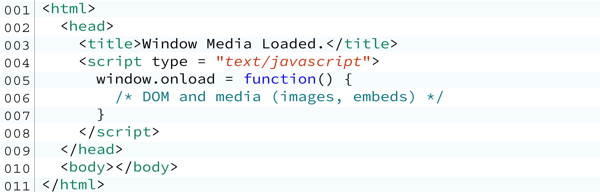
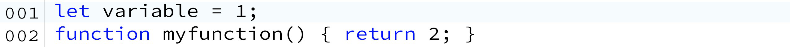
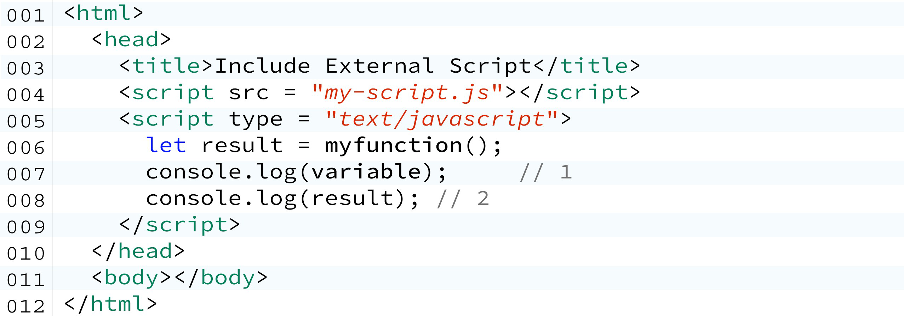
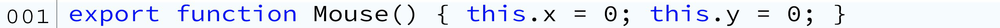

# 第三章 欢迎使用JavaScript

## 3.1 入口

每一个电脑程序都有一个**入口**。

你可以直接在`<script>`标签里开始书写代码。这意味着当脚本在浏览器中被下载它将立即被执行，而不关心**DOM**或者其他的媒体。

这会引发一个问题，因为在它们从服务器完全下载下来之前，你的代码可能会访问到**DOM**元素。

亡羊补牢，你可能要等待直到**DOM**树完全可用。

**DOMContentLoaded**

给文档对象添加一个事件监听，等待**DOM**事件。事件名字叫做**DOMContentLoaded**

图3.1 这里的入口就是普通函数load()，这是一个初始化应用程序的好地方。

你可以重命名load函数为**start**，**ready**或者**initialize** --- 这不重要。

重要的是我们百分之百保证这个入口： 所有的DOM元素已经被成功加载到内存，JavaScript去访问他们不会产生错误。

### 3.1.1 注意事项

**不要**把代码直接写在没有入口函数的`<script>`标签里。

**要**使用入口来初始化你的数据和对象的默认状态。

**要**让你的程序入口有**DOMContentLoaded**、****readyState**或者原生**window.onload**方法（取决于你需要等待仅仅只是DOM或者剩下的媒体）来等待媒体（见下一节）。

**.readyState**

为了增加安全性，你还可以在附加DOMContentLoaded事件之前检查readyState属性的值。 

图3.2 检查 document.readyState

**DOM vs Media**

我们刚刚为初始化应用程序创建了一个安全的地方。但是，由于DOM只是页面上所有HTML元素的树型结构，所以它通常在其他媒体（如图像和嵌入）之前可用。

即使 `<image src = "http://url" /> `是一个DOM元素，image标签src属性声明的URL内容可能需要更多的时间加载。

要检查是否任何非DOM 媒体内容已经完成加载，我们可以重载原生window.onload事件，如下例所示。

**window.onload**

使用window.onload方法，你可以等待直到所有的图片和类似的媒体文件都被完全加载。

**包括外部脚本**

我们一起看下在my-script.js文件中如下的定义：

然后你可以添加它们到你的应用程序主文件，如下所示：

如JavaScript应用程序主文件 - index.html。

**Import**

从ES6开始我们应该使用**import**（和**export**）关键字来从外部文件导入变量、函数、类。

假设我们有一个mouse.js文件，它有一个Mouse类如下定义：

为了让一个变量、对象或者一个函数可导出，**export**关键字必须预先定义。

但这还不够！只要应用程序主文件有匹配的导入，Mouse类构造函数就会被导出。

并非模块中的所有内容都将被导出。有些内容将（并且应该）对它保持私有。请确保将export关键字预先设置为要从文件中导出的任何内容。这可以是任何命名定义。 

**script type="module"**
