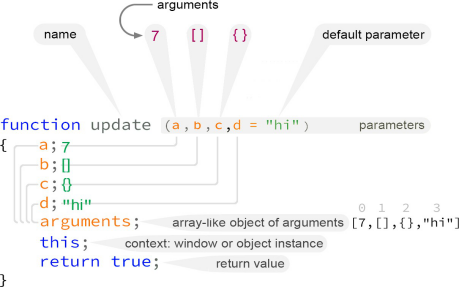
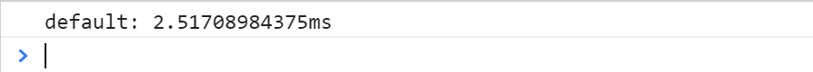

# JavaScript-Grammar
Grammar of JavaScript

# 《JavaScript语法》

## 0.1 前言
  我们经常将“功能”一词视为属于软件产品和服务的东西。例如，像Instagram和Twitter等现代应用程序都有“关注”的功能。将照片上传到您的帐户是另一项功能！

  但计算机语言也有功能。一个**函数**是一项功能。一个**for循环**是一项功能。 关键字class也是如此 --- 所有这些都是计算机语言功能。

  在JavaScript中，其中一些功能是从其他语言中借用的，然而许多功能仍然是自身的独特设计。诸如**this**，**class**和**const**之类的功能可能看起来与原始的C++实现类似，但在很多情况下它们都是以完全独特于JavaScript的方式使用。

  JavaScript是一种不断发展的语言。当EcmaScript 6于2015年6月问世时，语言的新功能经历了寒武纪爆发，这从根本上改变了如何编写JavaScript代码。

  新功能，如剩余参数符（...rest）和展开扩展符（...spread）语法，**箭头函数**，**模板字符串**，**对象解构**在现代JavaScript代码中很常见。但仅仅几年前，即使是有十多年的丰富的经验的JavaScript开发人员也无法想象这样的概念。

  函数式编程似光速般渗透到JavaScript社区。与数组相关联的多年来一直都处于休眠状态的高阶函数方法（**.map, .filter, .reduce**）越来越受欢迎。

  但JavaScript是一种多范式语言。拥有传统面向对象编程背景的程序员，在引入class关键字和单独的构造函数之后，发现了经典JavaScript对象函数构造函数的替代方法。

  ES6规范引发了一批全新的编程人员更加尊重曾经用于编写原始DOM脚本的语言。

  在浏览器中运行的JavaScript引擎（例如Chrome浏览器的V8）已经成熟，JavaScript不再被视为一种简单的脚本语言。

  这是JavaScript开发的全新时代。今天，你可能经常困惑在一个名为“**使用JavaScript构建机器人**”的视频中。几乎完全可以用JavaScript来构建Windows 10的桌面应用程序。

  像**React**和**Vue**这样的JavaScript框架和库抽象出了一些经典的JavaScript原则，可以更快地构建模块化应用程序。

  但这通常是以在初级水平永远不必了解vanilla JavaScript为代价的 - 它的共同语法。

  编写《JavaScript语法》是为了通过使用精心挑选的主题来解决这个问题，希望这些主题与自然的学习体验相匹配。 本书的内容将尽力忠实于JavaScript规范的动态特性。

  最后，希望本书能够鼓励读者在未来的更高级学科方向迈出下一步。


## 第一章 格式介绍

本书的结构考虑了连续性：它应该以连续的顺序从头到尾阅读。 但是，它也可以用作桌面参考，以便在需要时查找孤立的示例。

**《JavaScript语法》**不是完整的JavaScript参考或手册。 但是，这可能是一件好事。 主题被简化为现代JavaScript环境中的重要内容。

亦即： imports, classes, constructors, 函数式编程背后的关键原则，包括**ES5 - ES10**中许多功能都包含在本书中。

“ES”规范之间的区别变得不那么重要了。所有这些都是JavaScript。但只是为了给读者一点看法......

有时你会看到像这样的标签。

这仅仅意味着这个特性作为Ecmascript的ES10规范的一部分添加到了javascript中。

### 1.1 创意沟通

有些JavaScript很容易，有些很难。并非所有内容都可以仅通过源代码来解释。有些事情是基于无形的想法或原则。

在本教程中，您将看到许多有创造性的沟通手段，旨在使学习过程更轻松，也许会更有趣。

这其中的一个例子是颜色编码图解。

#### 1.1.1 理论

并非所有主题都需要广泛的理论。另一方面，有些事情没有它是没有意义的。为了充分理解一个特定的概念，在绝对必要的情况下，还将包括其他讨论。

#### 1.1.2 应用实例

在理论讨论的基础上，通过一个实例，我们可以看到具体的实现过程。通常用源代码列表来解释。

#### 1.1.3 源代码

将提供源代码清单，以巩固前文的基本原则。
```
// 从Bird类实例化sparrow实例
let sparrow = new Bird("sparrow", "gray");
sparrow.fly();
sparrow.wlak();
sparrow.lay_egg();
sparrow.talk(); // Error, 只有Parrot能talk
```

这是一个从Bird类实例化sparrow对象并使用它的一些方法的一个例子。

#### 1.1.4 颜色编码图解

在创建描述JavaScript背后的基本思想的图解方面投入了大量精力。它们是为了交流价值而设计的，在那些难以掌握的抽象概念需要用肉眼解释的地方，希望它们能够加速学习过程。 本书中有两种类型的图解：**抽象概念**和**源代码关闭**。

**抽象概念**

有时候没有图解就无法解释一个抽象概念或其结构。在这种情况下，会显示一个图解。

图 1.1：类的构造函数是Function类的对象函数。

这是另外一个可视化剖析JavaScript函数的图解：

图1.2： JavaScript函数剖析。

**源代码关闭**

大多数源代码都伴随着源代码列表。

但是当我们需要关闭一个特定的重要主题，将会显示一个略大的包含源代码和其他颜色编码突出显示的图解。例如，这是一个在事件回调函数的上下文中使用匿名函数的探索：

图1.3：异步函数用为setTimeout事件回调。

在此例中源代码忽略了行号因为它并不重要。

**内容**

我们不会花太多的书本空间和时间在无数的函数列表或每个对象上的可用方法上。这种类型的信息可以很容易地从Mozilla的MDN网络文档、W3Schools和StackOverflow在线查询和实践。

本书的大部分内容都是为现代JavaScript开发量身定做的，它倾向于>=ECMAScript6规范、函数编程：使用高阶数组函数、箭头函数以及理解执行上下文。

#### 1.1.5 行为准则

偶尔出现的该做和不该做的部分将提供富有洞察力的提示。

## 第二章 Chrome控制台

### 2.0.1 Console.log之外

许多程序员可能只知道Chrome浏览器的console.log，然而控制台API包含了一些其它有实际用途的方法，特别是在需要需要计时的场景下。

**copy(obj) 函数**

将现有对象的JSON表示形式复制到复制缓冲区：


现在JSON对象在复制粘贴缓冲区中，您可以将它粘贴到任何文本编辑器中。

在本例中，x是一个简单的自创建对象。但是想象一下这样一种情况：从数据库API返回一个更复杂的对象。

**注意：** 只返回JSON，这意味着方法不会到达复制缓冲区。（JSON字符串格式不支持方法，只支持属性。）

### 2.0.2 console.dir

如果要查看对象所有的属性和方法，可以使用console.dir方法直接打印到控制台：


神奇的是，你甚至可以打印输出DOM元素：


### 2.0.3 console.error


console.error的好处在于它还提供了堆栈跟踪：


### 2.0.4 console.time()和console.timeEnd()

您可以跟踪函数调用之间的时间量。这在优化代码时很有用：


控制台输出：


### 2.0.5 console.clear


**打印对象**
JavaScript中所有的对象都有.toString()方法。向console.log（value）提供对象时，它可以将其作为对象或字符串打印。


## 第三章 欢迎使用JavaScript

### 3.1 入口
...
